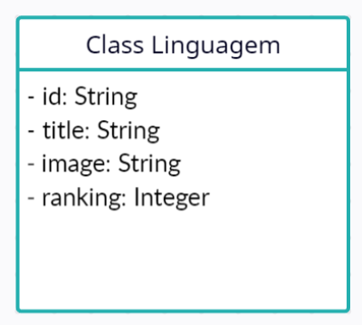

 

  

 

<h2>Descrição do Projeto</h2>

O projeto consiste no desenvolvimento de uma api para ranquear as linguagens de programação fazendo conecção com o banco de dados Mongo Db Atlas em nuvem. Exercício de fixação da aula 04 da imersão Java da Alura

<h2>Diagrama de Classes</h2>
 

  

<h2>Tecnologias utilizadas</h2>

* Spring Boot framework
* Spring MVC
* MongoDB Atlas

<h2>Ferramentas utilizadas</h2>

* Visual Studio Code

<h2>Repositório utilizado para obter as imagens png:</h2>

<a href="https://github.com/abrahamcalf/programming-languages-logos">Link</a> do repositório.

